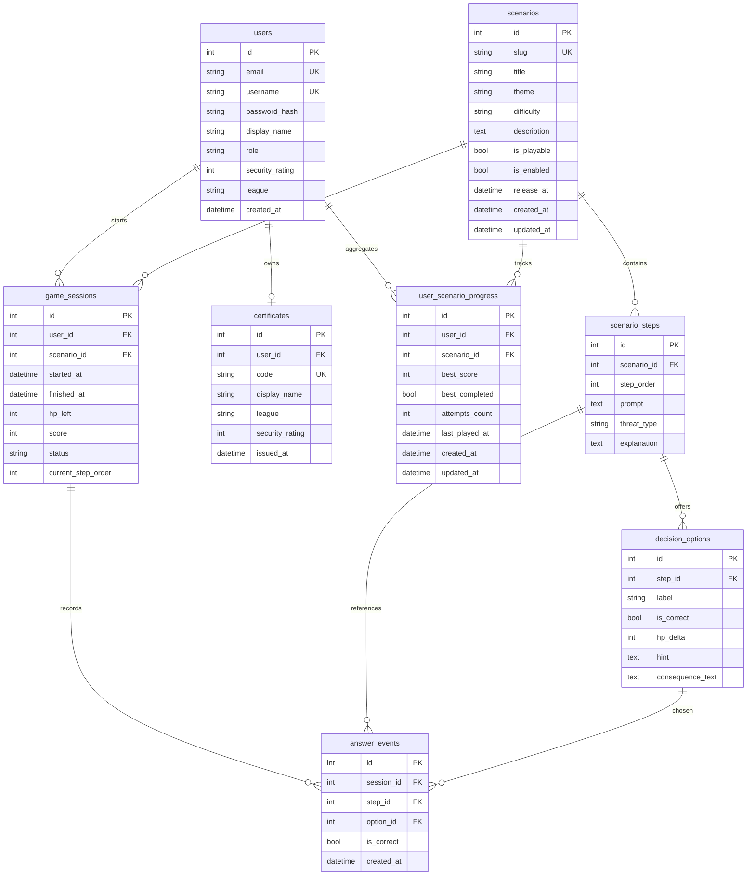

# ER Diagram

`users` хранит аутентификацию и роль, `game_sessions` фиксирует отдельные прохождения, `user_scenario_progress` агрегирует лучший результат по каждому сценарию, а `answer_events` позволяет строить статистику ошибок и детальный трекинг прогресса.
