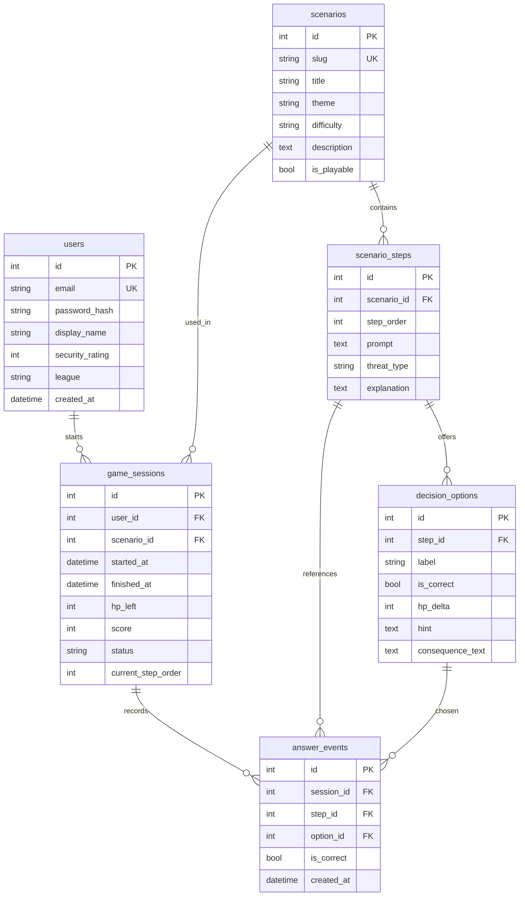

# ER Diagram

```mermaid
erDiagram
    users ||--o{ game_sessions : starts
    scenarios ||--o{ scenario_steps : contains
    scenarios ||--o{ game_sessions : used_in
    scenario_steps ||--o{ decision_options : offers
    game_sessions ||--o{ answer_events : records
    scenario_steps ||--o{ answer_events : references
    decision_options ||--o{ answer_events : chosen

    users {
        int id PK
        string email UK
        string password_hash
        string display_name
        int security_rating
        string league
        datetime created_at
    }

    scenarios {
        int id PK
        string slug UK
        string title
        string theme
        string difficulty
        text description
        bool is_playable
    }

    scenario_steps {
        int id PK
        int scenario_id FK
        int step_order
        text prompt
        string threat_type
        text explanation
    }

    decision_options {
        int id PK
        int step_id FK
        string label
        bool is_correct
        int hp_delta
        text hint
        text consequence_text
    }

    game_sessions {
        int id PK
        int user_id FK
        int scenario_id FK
        datetime started_at
        datetime finished_at
        int hp_left
        int score
        string status
        int current_step_order
    }

    answer_events {
        int id PK
        int session_id FK
        int step_id FK
        int option_id FK
        bool is_correct
        datetime created_at
    }
```

`users` хранит аутентификацию и накопительный рейтинг, `game_sessions` фиксирует прохождения, а `answer_events` позволяет строить статистику ошибок и детальный трекинг прогресса.

